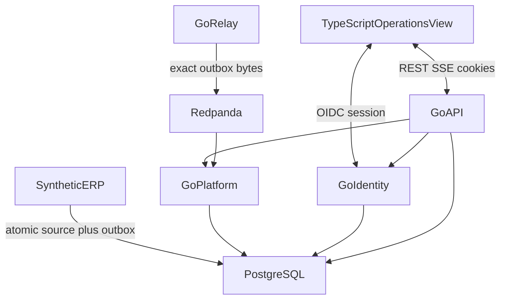

# Architecture

Implemented topology. Event Spine lives in `event/`, `northstar/`, `erp/`,
`relay/`, `platform/`, `api/`, `web/`. Identity lives in `identity/` plus
authorized HTTP. Not a deployment diagram.

Public demo uses **Northstar Foods** and a synthetic ERP. **Ahoy is excluded**
([CLEAN_ROOM.md](CLEAN_ROOM.md)). Authorization is default-deny; the UI is not
a security boundary.

| Component | Language | Owns | Must not own |
| --- | --- | --- | --- |
| `web/` | TypeScript | Presentation, REST/SSE clients | Authorization, datastore, broker |
| `identity/` | Go | OIDC Auth Code + PKCE, session, allow-list, audit | UI, IdP vendor as a runtime claim |
| `api/` | Go | HTTP/SSE, default-deny, privileged POSTs | Broker publication |
| `platform/` | Go | Inbox, inventory projection, rebuild | Outbox publication, authentication |
| `relay/` | Go | Publish exact outbox bytes to Redpanda | Inbox, authorization |
| `erp/` | Go | Order accept, inventory, immutable outbox | SeshatOps policy |
| `event/`, `northstar/` | Go | JSON/JCS envelope, Northstar fixture | Transport or HTTP |

Python, object storage, gRPC, Next.js, approvals, and ERP command dispatch
beyond order accept are not present. TypeScript must not own authorization.
Go module: `github.com/G1DO/seshatops`.

| Store | Responsibility |
| --- | --- |
| PostgreSQL | ERP source/outbox, platform inbox/projection, identity audit |
| Redpanda | At-least-once transport. Not the system of record |

OIDC sessions are process-local (`identity.Store`).

| Path | Rule |
| --- | --- |
| Browser ↔ Go | `/auth/*` and `/v1/*` only |
| ERP → PostgreSQL | Source and outbox in one transaction |
| Relay → Redpanda | Exact stored outbox bytes after commit |
| Browser → PostgreSQL or Redpanda | Prohibited |
| Exactly-once delivery | Not claimed |

An accepted source transaction survives broker outage. Duplicate delivery
cannot duplicate the inventory effect. Poison and version-gap events do not
halt unrelated aggregates. Missing identity context fails closed.

Wire and pins: [CONTRACTS.md](CONTRACTS.md). HTTP:
[openapi-projection.yaml](docs/architecture/openapi-projection.yaml). Authz:
[AUTHORIZATION.md](docs/security/AUTHORIZATION.md).
