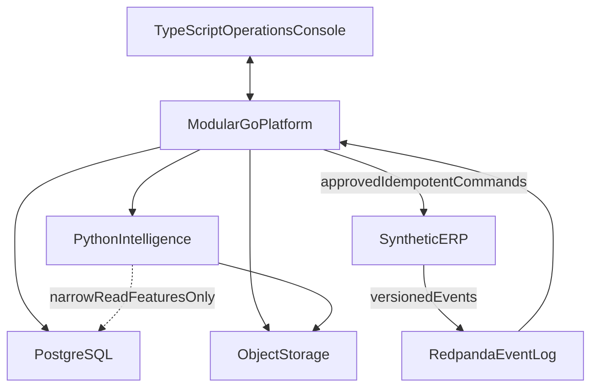
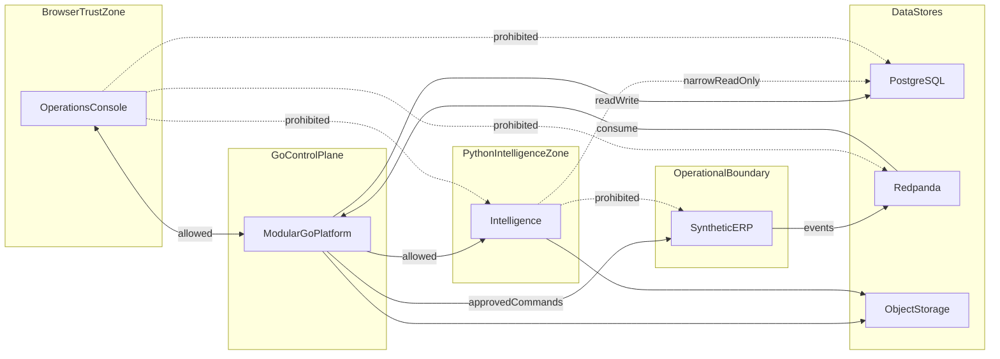
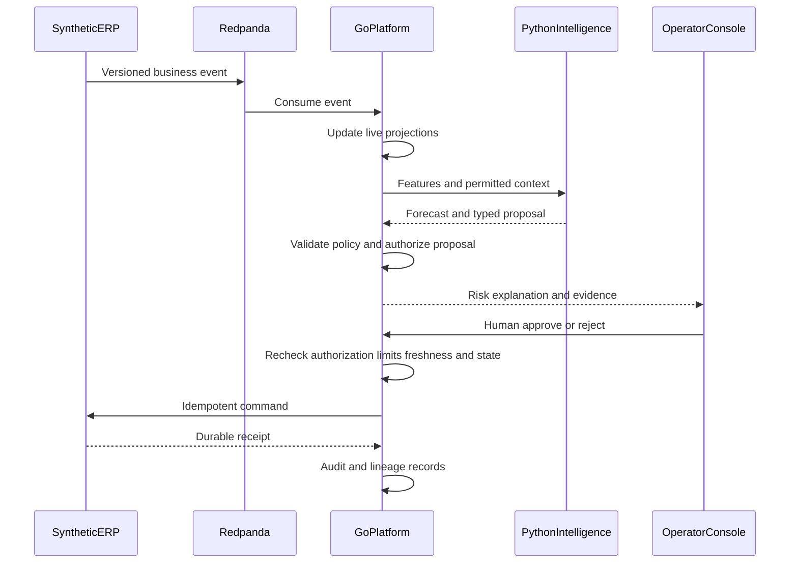

# ARCHITECTURE — SeshatOps Logical Boundaries

**Status:** Planned logical architecture. Implementation has not started. This document defines enforceable ownership, trust, and storage boundaries. It is not deployment architecture, runtime evidence, or a claim that services exist.

**Owns:** Logical system topology, language ownership, trust and communication boundaries, storage responsibilities, and high-level credential access boundaries.

**Does not own:** Event or command schemas, consistency and replay protocols (Issue #4), authorization matrix and threat model (Issue #5), evaluation protocols (Issue #6), reliability evidence protocols (Issue #7), roadmap and evidence ledger (Issue #8), repository layout and CI (Issue #9), or integrated constitution review (Issue #10).

Companion review: [docs/reviews/M0_ARCHITECTURE_REVIEW.md](docs/reviews/M0_ARCHITECTURE_REVIEW.md)

## 1. Purpose

SeshatOps is one public platform. Public demonstration uses the fictional **Northstar Foods** environment and a standalone synthetic ERP. The product must remain understandable and runnable without any private production system.

This document freezes **who owns what** and **who may talk to whom** so later milestones can implement without inventing a new architecture.

Logical architecture is distinct from future deployment architecture. One modular Go codebase may later run as multiple processes; process counts, hosts, and cloud topology are not specified here.

## 2. System context

### Actors

| Actor | Relationship to the platform |
| --- | --- |
| Operations manager | Uses the operations console to see risk, understand impact, and approve within assigned scope |
| Inventory / production planner | Uses the console to investigate stockout risk and prepare replenishment proposals |
| Platform / security operator | Uses the console for health, quarantine/replay controls, and audit access |
| Synthetic ERP | External operational system boundary for the public product: emits versioned business events and accepts authorized idempotent commands |

Authorization is default-deny. The UI may hide unavailable actions; server-side policy owned by Go is authoritative. Product narrative lives in [PRODUCT.md](PRODUCT.md).

### External boundary

- The only public operational system in this topology is the **synthetic ERP**.
- Optional private adapters (including any adapter to a private production system) live **outside** this repository and this topology. They must never become a required public runtime dependency.
- **Ahoy** is an excluded private system. It is not a component, dependency, or node in the public topology. See [CLEAN_ROOM.md](CLEAN_ROOM.md).

## 3. Logical system topology

### Component and responsibility ownership

| Component | Language | Owns | Must never own |
| --- | --- | --- | --- |
| Operations console | TypeScript | Browser UI; presentation and interaction state; generated API clients; user-facing rendering of proposals, evidence, approvals, receipts, and audit history | Authorization decisions; business-state transitions; business invariants; direct database access; direct broker access; direct calls to Python intelligence |
| Modular platform | Go | Transactional platform behavior; business-state transitions and invariants; authentication integration and authorization enforcement; tenant isolation; workflow and approval orchestration; command validation and execution; idempotency and durable receipts; audit records; replay coordination; public platform APIs; integration boundaries to external operational systems | Model training; unrestricted LLM execution; UI presentation ownership |
| Intelligence | Python | Forecasting; retrieval; evidence citation; explanation generation; typed proposals; model and evaluation workflows | Business-state writes; authorization; operational command execution; ERP or other operational mutation; receiving browser traffic; broad transactional-database credentials; turning free-form model output into executable actions |
| Synthetic ERP | Go | Synthetic operational transactions, inventory/batch behavior for the public demo, and command receipts | Platform projections; private production behavior; SeshatOps authorization policy |
| PostgreSQL | — | Authoritative transactional and governance state | Event transport |
| Redpanda | — | Durable asynchronous event transport and replay input | Authoritative transactional database; business authorization |
| Object storage | — | Immutable or versioned evidence artifacts, evaluation outputs, documents, exports, and larger binary artifacts | Mutable transactional truth |

## 4. Language ownership

### TypeScript

**Owns:** browser user interface; presentation and interaction state; generated API clients; user-facing rendering of proposals, evidence, approvals, receipts, and audit history.

**Must not own:** authorization decisions; business-state transitions; business invariants; direct database access; direct broker access; direct calls to Python intelligence services.

### Go

**Owns:** transactional platform behavior; business-state transitions and invariants; authentication integration and authorization enforcement; tenant isolation; workflow and approval orchestration; command validation and execution; idempotency and durable receipts; audit records; replay coordination; public platform APIs; integration boundaries to external operational systems; the synthetic ERP for the public scenario.

**Must not own:** model training or treating intelligence output as automatically executable.

### Python

**Owns:** evaluated intelligence capabilities — forecasting, retrieval, evidence citation, explanation generation, typed proposals, and model/evaluation workflows.

**Must not:** write business state; own authorization; execute operational commands; call an ERP or external operational system to mutate state; receive browser traffic directly; hold broad transactional-database credentials; turn free-form model output directly into executable actions.

Python output is **advisory** until validated, authorized, approved, and executed through Go-owned workflows.

### Language policy

The product implementation languages are **TypeScript**, **Go**, and **Python** only.

| Language | Role |
| --- | --- |
| TypeScript | Browser UI |
| Go | Transactional and platform behavior (including synthetic ERP) |
| Python | Evaluated intelligence |

**Not used:** C is permanently excluded. Rust is not a product language and must not be introduced for breadth; it may enter only if a later ADR records a measured performance or safety need for one isolated component.

## 5. Storage responsibilities

| Store | Responsibility |
| --- | --- |
| PostgreSQL | Authoritative transactional and governance state (workflows, projections as committed state, and audit records). Event-consumption and idempotency mechanisms are Issue #4 |
| Redpanda | Durable asynchronous event transport and replay **input**. Not the authoritative transactional database |
| Object storage | Immutable or versioned evidence artifacts, evaluation outputs, documents, exports, and larger binary artifacts |

This document does not define tables, topics, buckets, retention periods, partition counts, vendors, deployment sizes, or exact schemas. Publication, consumption, and related broker protocols are Issue #4.

## 6. Communication boundaries

Concrete transports (for example request/response shapes, streaming mechanisms, or RPC frameworks), endpoint paths, and package layouts are deferred to later issues. The rules below are **logical** path permissions.

### Allowed communication paths

| Path | Rule |
| --- | --- |
| Browser ↔ Go platform | Only public platform APIs. Generated clients may be used in the UI |
| Synthetic ERP → Redpanda | Versioned business events for platform consumption |
| Redpanda → Go platform | Event consumption for reconstruction, workflows, and replay coordination |
| Go platform → Python intelligence | Go initiates intelligence requests; Python returns predictions, explanations, and typed proposals on that invocation |
| Go platform → PostgreSQL | Transactional reads and writes for authoritative state |
| Python → PostgreSQL | Narrow, non-transactional read of approved feature or read surfaces only; no workflow or business-state writes |
| Go platform → object storage | Persist or retrieve governance and operational artifacts as needed |
| Python → object storage | Persist or retrieve evaluation outputs, models, documents, and related artifacts |
| Go platform → synthetic ERP | Approved, idempotent operational commands only |

### Prohibited communication paths

| Path | Reason |
| --- | --- |
| Browser → Python | Intelligence is not a browser-facing surface |
| Browser → database | No direct datastore access from the UI |
| Browser → broker | No direct event-log access from the UI |
| Python → transactional business-state writes | Go owns business-state transitions |
| Python → external operational commands | Go owns command execution to the ERP and similar systems |
| UI-owned authorization | Hiding controls is not a security boundary; Go policy is authoritative |
| Private adapter as required public runtime dependency | Public topology must run without private adapters |

### Trust and data-flow boundaries

## 7. Primary governed proposal-to-execution flow

Capability-level path for the primary demo story. Aligns with [PRODUCT.md](PRODUCT.md) hero steps 9–11. Not an implementation claim and not a protocol specification.

Python proposals remain advisory until Go validates policy and authorizes them, an authorized human approves, Go rechecks authorization, limits, freshness, and current state, and Go executes the command. Detailed event-consumption, consistency, and retry protocols are Issue #4.

## 8. Failure isolation

At the boundary level only (retry algorithms, envelopes, and consistency protocols belong to Issue #4):

- Python unavailability must not stop core transactional operations owned by Go.
- Intelligence features may degrade or become unavailable independently.
- Business writes and authorization remain owned by Go whether or not intelligence is reachable.
- Core observe → reconstruct → authorize → approve → execute → audit paths must not require Python to be healthy.

## 9. High-level credential and access boundaries

This table is not the complete authorization model. Issue #5 owns threat modeling and authorization assumptions.

| Principal | May hold | Must not hold |
| --- | --- | --- |
| Browser / UI | End-user session credentials for Go platform APIs | Database credentials; broker credentials; Python service credentials; ERP mutation credentials |
| Go platform | Credentials needed for PostgreSQL transactional access, Redpanda consume access, object storage, Python invocation, and approved ERP command APIs | Unscoped “do anything” secrets that bypass tenant and policy checks; Redpanda produce credentials (publication ownership is Issue #4) |
| Python intelligence | Narrow read credentials for approved feature or read surfaces; object-storage credentials for intelligence artifacts | Broad transactional-database write credentials; ERP mutation credentials; authority to approve or execute workflows |
| Synthetic ERP | Its own operational datastore credentials | Platform projection write access; SeshatOps policy credentials |
| Private adapters | Out of public topology | Any requirement that public SeshatOps cannot run without them |

## 10. Document ownership

| Artifact | Owns |
| --- | --- |
| [PRODUCT.md](PRODUCT.md) | Product thesis, users, workflows, capability boundaries, non-goals |
| [CLEAN_ROOM.md](CLEAN_ROOM.md) | Public/private boundary and review policy |
| `ARCHITECTURE.md` | Logical topology, language ownership, trust and communication paths, storage and high-level access boundaries |
| Later M0 documents | Event/command principles, threat model, evaluation and reliability protocols, roadmap, evidence ledger, repository instructions |

Notion may hold planning intent. This repository owns publishable architectural truth for SeshatOps.
