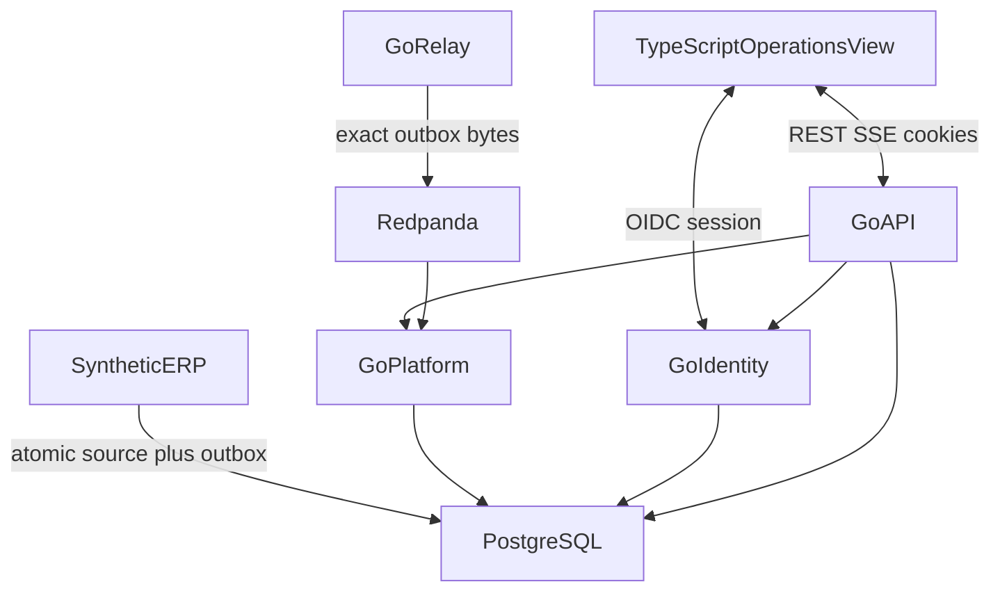

# ARCHITECTURE — SeshatOps as built

**Status:** Current implemented topology. Event Spine packages
(`event/`, `northstar/`, `erp/`, `relay/`, `platform/`, `api/`, `web/`)
implement the event path. Package `identity/` implements OIDC session,
tenant policy, and privileged-decision audit. This is not deployment
architecture or production evidence.

**Owns:** Logical system topology as it exists now, language ownership for
implemented and reserved roles, trust and communication boundaries, and
storage responsibilities that are actually in use.

**Does not own:** Event schemas and checksum rules ([CONTRACTS.md](CONTRACTS.md)),
authorization matrix ([docs/security/PERMISSION_MATRIX.md](docs/security/PERMISSION_MATRIX.md)),
or claim status ([EVIDENCE.md](EVIDENCE.md)).

Product intent and later capability design live in Notion. Do not read this
document as a forecast of Python intelligence, object storage, approvals, or
cloud topology.

## 1. System context

Public demonstration uses **Northstar Foods** and a standalone synthetic ERP.
The product must remain understandable and runnable without any private
production system. **Ahoy** is excluded. See [CLEAN_ROOM.md](CLEAN_ROOM.md).

| Actor | Relationship |
| --- | --- |
| Operations manager / planner | Uses the operations view to inspect inventory and processing health within assigned tenant and role |
| Platform / security operator | Uses authorized privileged controls for quarantine, replay, rebuild, and audit read |
| Synthetic ERP | Records accepted transactions and outbox intent; publishes versioned events through the source-owned relay |

Authorization is default-deny. The UI may hide unavailable actions; Go policy
is authoritative.

## 2. Implemented topology

### Components

| Component | Language | Owns now | Must not own |
| --- | --- | --- | --- |
| Operations view (`web/`) | TypeScript (Vite/React) | Presentation, session display, REST/SSE clients | Authorization, business-state writes, database or broker access |
| Identity (`identity/`) | Go | OIDC Authorization Code + PKCE, Go-owned session, allow-list policy, privileged-decision audit | UI presentation, IdP product selection as a runtime claim |
| API (`api/`) | Go | HTTP/SSE surfaces, default-deny enforcement, privileged POSTs | UI rendering, broker publication |
| Platform (`platform/`) | Go | Inbox, inventory projection, rebuild, tenant-scoped inspect/replay helpers | Source outbox publication, authentication |
| Relay (`relay/`) | Go | Claim outbox rows and publish exact bytes to Redpanda | Inbox/projection, authorization |
| Synthetic ERP (`erp/`) | Go | One-line order accept, inventory, immutable outbox | Platform projections, SeshatOps policy |
| Event contract (`event/`, `northstar/`) | Go | JSON/JCS envelope, Northstar fixture | Transport or HTTP |

Python intelligence, object storage, gRPC, Next.js, generated API clients,
approval workflows, and ERP command dispatch beyond synthetic order accept
are **not present**.

## 3. Language ownership

| Language | Role now | Reserved / prohibited |
| --- | --- | --- |
| TypeScript | Browser UI only | Must not own authorization or transactional state |
| Go | Transactional platform, event processing, authorization, synthetic ERP | Must not treat intelligence output as automatically executable |
| Python | Not implemented | When introduced: advisory intelligence only; no writes, authz, or commands |
| Rust | Not used | Measurement-gated isolated component only, after an ADR |
| C | Excluded | Not part of this project |

The Go module is `github.com/G1DO/seshatops` (Go `1.25.0`). Later sequences
may extend these packages; they must not invent a second module or a general
ERP schema.

## 4. Storage in use

| Store | Responsibility |
| --- | --- |
| PostgreSQL | Authoritative transactional state: ERP source/outbox, platform inbox/projection, identity authorization-decision audit |
| Redpanda | Durable asynchronous event transport and replay input. Not the transactional system of record |

OIDC sessions and pending logins are process-local memory (`identity.Store`),
not a PostgreSQL table. Object storage is not in the implemented topology.

## 5. Communication boundaries

### Allowed now

| Path | Rule |
| --- | --- |
| Browser ↔ Go | Public `/auth/*` and `/v1/*` APIs only |
| Synthetic ERP → PostgreSQL | Source state and outbox intent in one transaction |
| Relay → Redpanda | Exact stored outbox bytes after commit |
| Redpanda → Go platform | At-least-once consume into transactional inbox |
| Go → PostgreSQL | Transactional reads and writes for owned schemas |

### Prohibited

| Path | Reason |
| --- | --- |
| Browser → PostgreSQL or Redpanda | No datastore or broker access from the UI |
| UI-owned authorization | Hiding controls is not a security boundary |
| Private adapter as required runtime | Public topology must run without Ahoy or other private systems |
| Exactly-once delivery claims | Delivery is at-least-once with idempotent business effects |

## 6. Failure isolation (implemented path)

- An accepted source transaction remains durable if the broker is down.
- Duplicate delivery cannot duplicate the inventory projection effect.
- Poison, unsupported-version, and aggregate-version-gap events do not halt
  unrelated aggregates.
- Missing, stale, or contradictory identity context fails closed.

Python unavailability is not a current operational concern because Python is
not in the topology. If intelligence is added later, core Go transactional
operations must remain available without it.

## 7. Related documents

| Artifact | Owns |
| --- | --- |
| [CONTRACTS.md](CONTRACTS.md) | Event envelope, outbox, inbox, checksum, toolchain pins |
| [EVENT_MODEL.md](docs/architecture/EVENT_MODEL.md) | Event meaning and invariants |
| [docs/adrs/](docs/adrs/) | Consequential decisions, including ADR-0005 identity |
| [docs/security/](docs/security/) | Threat model and implemented authz surfaces |
| [CLEAN_ROOM.md](CLEAN_ROOM.md) | Public/private boundary |
| [EVIDENCE.md](EVIDENCE.md) | What may be claimed |
