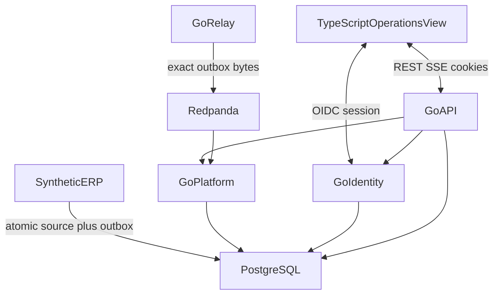

# Architecture

Packages below are the as-built Event Spine and Identity HTTP. Tests compose
`http.Handler` values and call `relay.DrainOnce` / `platform.ConsumeOnce`.
There is no deployment binary or long-running daemon in this repository.

Event Spine lives in `event/`, `northstar/`, `erp/`, `relay/`, `platform/`,
`api/`, `web/`. Identity lives in `identity/` plus authorized HTTP. Public
demo uses **Northstar Foods**. **Ahoy is excluded**
([CLEAN_ROOM.md](../CLEAN_ROOM.md)).

| Component | Language | Owns | Must not own |
| --- | --- | --- | --- |
| `web/` | TypeScript | Presentation, REST/SSE clients | Authorization, datastore, broker |
| `identity/` | Go | OIDC Auth Code + PKCE, session, allow-list, audit | UI, IdP vendor as a runtime claim |
| `api/` | Go | HTTP/SSE, default-deny, privileged POSTs | Broker publication |
| `platform/` | Go | Inbox, inventory projection, rebuild | Outbox publication, authentication |
| `relay/` | Go | Publish exact outbox bytes to Redpanda | Inbox, authorization |
| `erp/` | Go | Order accept, inventory, immutable outbox | SeshatOps policy |
| `event/`, `northstar/` | Go | JSON/JCS envelope, Northstar fixture | Transport or HTTP |

Go module: `github.com/G1DO/seshatops`. Privileged operator POSTs (quarantine
release, replay, rebuild) are in [AUTHORIZATION.md](../security/AUTHORIZATION.md).
There is no Python, object storage, or ERP command API beyond `erp.AcceptOrder`.

| Store | Responsibility |
| --- | --- |
| PostgreSQL | ERP source/outbox, platform inbox/projection, identity audit |
| Redpanda | At-least-once transport. Not the system of record |

OIDC sessions are process-local (`identity.Store`).

| Path | Rule |
| --- | --- |
| Browser ↔ Go | `/auth/*` and `/v1/*` only |
| ERP → PostgreSQL | Source and outbox in one transaction |
| Relay → Redpanda | Exact stored outbox bytes after commit |
| Browser → PostgreSQL or Redpanda | Prohibited |

Wire and pins: [CONTRACTS.md](../CONTRACTS.md). `/v1` HTTP/SSE:
[openapi-projection.yaml](openapi-projection.yaml). `/auth`
and allow-list: [AUTHORIZATION.md](../security/AUTHORIZATION.md).
