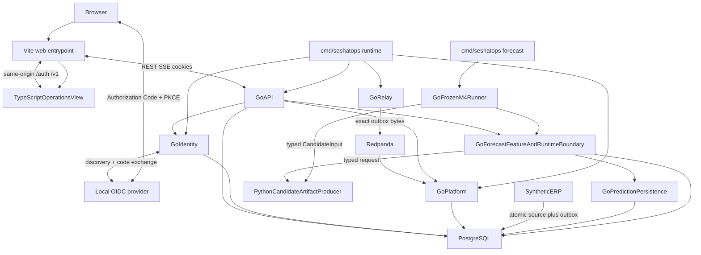

# Architecture

Packages below are the as-built Event Spine, Identity HTTP, M4 stockout
evaluation library, Go-owned forecast feature/runtime boundary, and one-shot
candidate artifact adapter. The `cmd/seshatops` process composes the packages,
applies all three PostgreSQL migrations before serving, and owns the HTTP,
outbox-relay, and Redpanda-consumer lifecycles. Its explicit `bootstrap`
subcommand uses the same ERP, outbox, relay, and consumer boundaries to create
the versioned Northstar M0–M3 scenario and waits for its projection checkpoint.
Its explicit `forecast` subcommand rebuilds the frozen M4 Northstar history,
dataset, and raw feature snapshot, invokes the bounded offline Python artifact
producer, evaluates and selects in Go, and persists one Go-owned advisory
prediction through `platform.ForecastService`. It does not make the live
Event Spine history look like the frozen M4 fixture.
The separate `reset-northstar` subcommand is restricted to a confirmed local
database named `seshatops_northstar_disposable`. Tests compose `http.Handler`
values and call `relay.DrainOnce` / `platform.ConsumeOnce`.

`compose.yaml` packages this topology for a disposable local run. It starts
PostgreSQL, Redpanda, the Go runtime, Vite, and a public-safe mock OIDC
provider behind readiness gates. The browser reaches the Vite entrypoint, but
Vite proxies only same-origin `/auth/*` and `/v1/*` requests to Go; PostgreSQL,
Redpanda, and Go have no host-published ports. The local OIDC flow is a real
Authorization Code + PKCE exchange, not a test-session or trusted-tenant
header shortcut.

Event Spine lives in `event/`, `northstar/`, `erp/`, `relay/`, `platform/`,
`api/`, `web/`. Identity lives in `identity/` plus authorized HTTP. Stockout
evaluation and the pure raw feature builder live in `forecast/`; the
tenant-scoped PostgreSQL replay boundary lives in `platform/` and its HTTP
route/authentication lives in `api/`. Python is an offline artifact producer
and one-shot runtime adapter, not a deployed service or database principal. Public demo uses
**Northstar Foods**. **Ahoy is excluded**
([CLEAN_ROOM.md](../CLEAN_ROOM.md)).

`cmd/seshatops` fail-closes on `SESHATOPS_*` before opening clients:
`SESHATOPS_LISTEN_ADDR` must be `host:port` with port `1-65535`;
`SESHATOPS_DATABASE_URL` must be `postgres://`/`postgresql://` with host and user and no fragment;
`SESHATOPS_BROKER_SEEDS` must be comma-separated `host:port` with no empty or duplicate entries;
`SESHATOPS_OIDC_ISSUER` must be `http`/`https` with no credentials/query/fragment;
`SESHATOPS_OIDC_REDIRECT_URL` must be absolute `http`/`https` with path `/auth/callback` and no credentials/query/fragment;
`SESHATOPS_COOKIE_SECURE` must match the redirect scheme;
`SESHATOPS_SESSION_TTL` must be a positive duration;
`SESHATOPS_AUTH_ASSIGNMENTS` must be `principal|tenant|role` rows with three non-empty trimmed fields
and no extra separators; and worker intervals (`RelayInterval` `500ms`, `PollTimeout` `1s`,
`CycleTimeout` `10s`, `Shutdown` `10s`) must be positive with `RetryMax >= RetryBase`.
`SESHATOPS_OIDC_CLIENT_SECRET` remains optional to support PKCE public clients — confidential clients
fail later on token exchange, which is intentional.
It exposes `GET /livez`, `GET /readyz`, and public `GET /version`
(`version/commit/build_time/go_version/fixture/protocol/checksum`, also `seshatops version`
and `seshatops_build_info{version,commit}` in `/metrics`);
`database`/`migrations`/`broker` readiness reflect startup `Ping` + `Migrate` success, while runtime
DB or broker outages after startup surface within one interval via the relay and consumer worker loops
that flip readiness. The relay worker probes the broker only when idle (`claimed == 0`) or on transient
publish failures and caches healthy successes for one `CycleTimeout` (default `10s`) to bound load while
re-probing immediately on failure; logging is ordered after the probe so `relay.cycle.failed` reflects
the outage and flips `seshatops_runtime_ready` correctly.
The process handles `SIGINT`/`SIGTERM` by stopping HTTP acceptance, cancelling the relay and consumer
loops, closing their broker clients, clearing the post-commit projection notifier, and closing PostgreSQL.
Worker failures use bounded process retry backoff in addition to the existing outbox and broker semantics.
It also emits JSON structured logs and an authenticated aggregate `/metrics`
release surface; the surface is process-local where documented, excludes
tenant and business labels, and never makes optional forecast/Python
availability part of core readiness. See [release
observability](../operations/observability.md) and [reproducibility](../REPRODUCIBILITY.md).

The executable reads `SESHATOPS_LISTEN_ADDR`, `SESHATOPS_DATABASE_URL`,
`SESHATOPS_BROKER_SEEDS`, `SESHATOPS_OIDC_ISSUER`,
`SESHATOPS_OIDC_CLIENT_ID`, `SESHATOPS_OIDC_REDIRECT_URL`,
`SESHATOPS_COOKIE_NAME`, and `SESHATOPS_COOKIE_SECURE`. The OIDC client secret,
audience, session TTL, and optional process-local assignments are configured by
`SESHATOPS_OIDC_CLIENT_SECRET`, `SESHATOPS_OIDC_AUDIENCE`,
`SESHATOPS_SESSION_TTL`, and `SESHATOPS_AUTH_ASSIGNMENTS` respectively.
Assignments use comma-separated `principal|tenant|role` rows; an omitted
assignment list leaves the policy default-deny.

The OIDC client secret is intentionally optional: PKCE public clients omit it and confidential clients fail later on token exchange. Assignments are fail-closed — blank, extra-field, or empty-field rows are rejected before startup.

The Compose-only `SESHATOPS_LOCAL_STACK=true` opt-in permits the forecast
subcommand to use the exact internal `postgres` service name. It does not
broaden the normal localhost-only guard used by `reset-northstar`.

| Component | Language | Owns | Must not own |
| --- | --- | --- | --- |
| `web/` | TypeScript | Presentation, REST/SSE clients | Authorization, datastore, broker |
| `cmd/seshatops` | Go | Process startup, migrations, health, HTTP, worker lifecycle, explicit Northstar bootstrap, forecast, and reset entrypoints | Domain rules, authorization decisions, event transformation |
| `identity/` | Go | OIDC Auth Code + PKCE, session, allow-list, audit | UI, IdP vendor as a runtime claim |
| `api/` | Go | HTTP/SSE, default-deny, privileged POSTs | Broker publication |
| `platform/` | Go | Inbox, inventory and lineage projection, read-only forecast source replay, runtime predictor selection/invocation, validated prediction persistence, rebuild | Outbox publication, authentication, feature-table ownership |
| `relay/` | Go | Publish exact outbox bytes to Redpanda | Inbox, authorization |
| `erp/` | Go | Lineage hops, order accept, inventory, immutable outbox | SeshatOps policy |
| `event/`, `northstar/` | Go | JSON/JCS envelope, Northstar fixture | Transport or HTTP |
| `forecast/` | Go | Frozen stockout target, temporal dataset, pure raw feature snapshots, typed artifact/runtime validation, evaluation metrics, promotion comparison, deterministic runtime baselines | Transactional state, HTTP, labels in runtime feature rows, Python process management, model serving |
| `forecast_candidate/` | Python | Produce versioned prediction artifacts and answer one-shot typed runtime requests from supplied artifact context | PostgreSQL credentials, writes, authorization, workflow transitions, promotion decisions |

Go module: `github.com/G1DO/seshatops`. Privileged operator POSTs (quarantine
release, replay, rebuild) are in [authorization.md](../security/authorization.md).
There is no deployed Python service, object storage, or HTTP ERP command surface. Package `erp`
accepts `RegisterSupplier`, `ReceiveIngredientLot`, `ProduceProductionBatch`,
`DispatchShipment`, and `AcceptOrder`. The TypeScript UI cannot authorize those
writes. `GET /v1/tenants/{tenant_id}/forecast/features` is a read-only Go
boundary over retained `erp.outbox`, `platform.inbox`, and
`platform.inventory_projection` rows; it never stores feature rows or
snapshots and never calls a projection mutator. `platform.ForecastService`
selects the runtime predictor only from the frozen test outcome, invokes a
promoted candidate through a bounded typed subprocess boundary, computes the
selected baseline in Go, and persists validated records in
`platform.forecast_predictions`. The `forecast` command separately invokes
the existing offline artifact producer through the same bounded process
discipline and evaluates its complete artifact in Go before calling that
service.
Authorized `GET /v1/tenants/{tenant_id}/forecast/predictions/{resource_id}`
reads the latest tenant-scoped record and reports whether its feature
snapshot still matches the current complete Go-owned source snapshot.

| Store | Responsibility |
| --- | --- |
| PostgreSQL | ERP source/outbox, platform inbox/projection, identity audit |
| Redpanda | At-least-once transport. Not the system of record |

OIDC sessions and configured authorization assignments are process-local
(`identity.Store` and `identity.Directory`).

| Path | Rule |
| --- | --- |
| Browser ↔ Go | `/auth/*` and `/v1/*` only |
| ERP → PostgreSQL | Source and outbox in one transaction |
| Relay → Redpanda | Exact stored outbox bytes after commit |
| Browser → PostgreSQL or Redpanda | Prohibited |
| Go → Python | One-shot typed request/artifact boundary with a deadline; no browser or Python write path |

Wire and pins: [event-spine.md](../design/specifications/event-spine.md).
Stockout evaluation: [stockout-evaluation.md](../design/specifications/stockout-evaluation.md).
Forecast feature snapshots: [forecast-feature-snapshots.md](../design/specifications/forecast-feature-snapshots.md).
`/v1` HTTP/SSE: [openapi-projection.yaml](../api/openapi-projection.yaml).
`/auth` and allow-list: [authorization.md](../security/authorization.md).
Operations and recovery: [operations/README.md](../operations/README.md), [observability](../operations/observability.md), [runbooks](../operations/runbooks/broker-interruption.md).
Compatibility and toolchain: [COMPATIBILITY.md](../COMPATIBILITY.md).
Troubleshooting: [TROUBLESHOOTING.md](../TROUBLESHOOTING.md).
Known limitations and deferred/rejected: [KNOWN_LIMITATIONS.md](../KNOWN_LIMITATIONS.md).
Security scope: [../../SECURITY.md](../../SECURITY.md). Release notes: [../../CHANGELOG.md](../../CHANGELOG.md). Release audit: [../evaluation/RELEASE_AUDIT_REPORT.md](../evaluation/RELEASE_AUDIT_REPORT.md).
