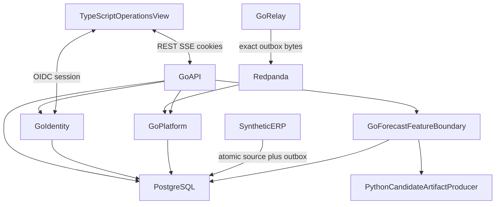

# Architecture

Packages below are the as-built Event Spine, Identity HTTP, M4 stockout
evaluation library, Go-owned forecast feature read boundary, and offline
candidate artifact contract. Tests compose `http.Handler` values and call
`relay.DrainOnce` / `platform.ConsumeOnce`. There is no deployment binary or
long-running daemon in this repository.

Event Spine lives in `event/`, `northstar/`, `erp/`, `relay/`, `platform/`,
`api/`, `web/`. Identity lives in `identity/` plus authorized HTTP. Stockout
evaluation and the pure raw feature builder live in `forecast/`; the
tenant-scoped PostgreSQL replay boundary lives in `platform/` and its HTTP
route/authentication lives in `api/`. Python is an offline artifact producer
only; it is not a deployed runtime or database principal. Public demo uses
**Northstar Foods**. **Ahoy is excluded**
([CLEAN_ROOM.md](../CLEAN_ROOM.md)).

| Component | Language | Owns | Must not own |
| --- | --- | --- | --- |
| `web/` | TypeScript | Presentation, REST/SSE clients | Authorization, datastore, broker |
| `identity/` | Go | OIDC Auth Code + PKCE, session, allow-list, audit | UI, IdP vendor as a runtime claim |
| `api/` | Go | HTTP/SSE, default-deny, privileged POSTs | Broker publication |
| `platform/` | Go | Inbox, inventory and lineage projection, read-only forecast source replay, rebuild | Outbox publication, authentication, feature persistence |
| `relay/` | Go | Publish exact outbox bytes to Redpanda | Inbox, authorization |
| `erp/` | Go | Lineage hops, order accept, inventory, immutable outbox | SeshatOps policy |
| `event/`, `northstar/` | Go | JSON/JCS envelope, Northstar fixture | Transport or HTTP |
| `forecast/` | Go | Frozen stockout target, temporal dataset, pure raw feature snapshots, typed artifact validation, evaluation metrics, promotion comparison | Transactional state, HTTP, labels in feature rows, Python runtime, model serving |
| `forecast_candidate/` | Python | Produce versioned prediction artifacts from serialized read-only dataset/features | PostgreSQL credentials, writes, authorization, workflow transitions, promotion decisions |

Go module: `github.com/G1DO/seshatops`. Privileged operator POSTs (quarantine
release, replay, rebuild) are in [authorization.md](../security/authorization.md).
There is no deployed Python runtime, object storage, or HTTP ERP command surface. Package `erp`
accepts `RegisterSupplier`, `ReceiveIngredientLot`, `ProduceProductionBatch`,
`DispatchShipment`, and `AcceptOrder`. The TypeScript UI cannot authorize those
writes. `GET /v1/tenants/{tenant_id}/forecast/features` is a read-only Go
boundary over retained `erp.outbox`, `platform.inbox`, and
`platform.inventory_projection` rows; it never stores feature rows or
snapshots and never calls a projection mutator.

| Store | Responsibility |
| --- | --- |
| PostgreSQL | ERP source/outbox, platform inbox/projection, identity audit |
| Redpanda | At-least-once transport. Not the system of record |

OIDC sessions are process-local (`identity.Store`).

| Path | Rule |
| --- | --- |
| Browser ↔ Go | `/auth/*` and `/v1/*` only |
| ERP → PostgreSQL | Source and outbox in one transaction |
| Relay → Redpanda | Exact stored outbox bytes after commit |
| Browser → PostgreSQL or Redpanda | Prohibited |

Wire and pins: [event-spine.md](../design/specifications/event-spine.md).
Stockout evaluation: [stockout-evaluation.md](../design/specifications/stockout-evaluation.md).
Forecast feature snapshots: [forecast-feature-snapshots.md](../design/specifications/forecast-feature-snapshots.md).
`/v1` HTTP/SSE: [openapi-projection.yaml](../api/openapi-projection.yaml).
`/auth` and allow-list: [authorization.md](../security/authorization.md).
