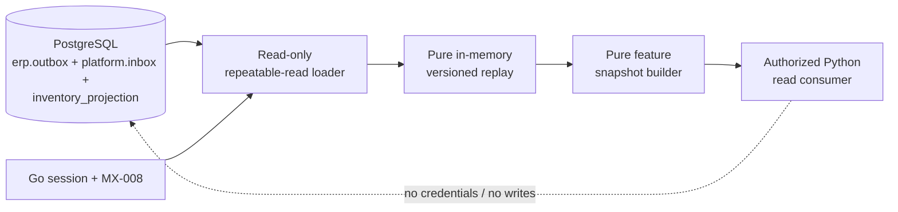

# M4 Forecast Feature Snapshots

The Go-owned forecast feature boundary is an on-demand, tenant-scoped,
read-only projection of retained Event Spine inventory history. It produces
raw cutoff-safe feature rows for the frozen `m4-stockout-eval-v1` protocol.
It does not train a model, persist a feature table, provide labels, or give a
Python process database credentials.

Versions are fixed by the server:

| Contract | Value |
| --- | --- |
| Dataset | `m4-stockout-eval-v1` |
| Feature definition | `m4-raw-onhand-v1` |
| Snapshot contract | `1` |
| Availability clock | Event `recorded_at` (UTC) |
| Tenant authority | Go session, policy, and path tenant assertion |

## Source boundary

One PostgreSQL transaction is opened with `READ ONLY` and `REPEATABLE READ`.
Every tenant-scoped query applies `tenant_id = $1`; the parsed event tenant is
checked again before the event can enter replay. The loader reads only:

- `erp.outbox`: retained canonical event bytes, event identity, content hash,
  aggregate version, outbox status, and source `recorded_at`.
- `platform.inbox`: this consumer's disposition and content hash. Only
  `applied` and `duplicate_noop` inventory dispositions are replay inputs.
- `platform.inventory_projection`: current tenant item quantity, aggregate
  version, and the projection checksum.

M3 lineage events are not forecasting inputs. The loader does not read or use
lineage tables, does not call `ProcessRecord`, rebuild helpers, or replay
mutators, and does not insert feature or snapshot records.

`recorded_at` is the availability timestamp. An event whose `recorded_at` is
after a declared source cutoff is unavailable even when `occurred_at` is
earlier. The HTTP endpoint uses the current retained applied boundary; its
response records the maximum applied `recorded_at`, its UTC cutoff date, the
applied-event count, and both source checksums. A future source event is
therefore a new boundary, not a retroactive change to an earlier cutoff.

## Replay rules

Inventory events are grouped by `(tenant_id, aggregate_id)` and sorted by
`aggregate_version`, then `event_id`. Each aggregate must start at version 1
and remain contiguous. For every event:

1. The event bytes must parse as an accepted inventory event and retain the
   same event id, tenant, aggregate, and `recorded_at` as the outbox row.
2. The outbox content hash and inbox content hash must match the parsed event.
3. `quantity_before` must equal the in-memory quantity from the preceding
   version (version 1 establishes the declared initial quantity).
4. `quantity_before - quantity_decremented` must equal `quantity_after`, and
   the resulting quantity must remain non-negative.
5. The observation is placed on the UTC calendar date of `recorded_at`.

Duplicate delivery is represented by one inbox disposition and one retained
outbox event, so it cannot create a second observation. The replayed terminal
quantity and aggregate version must equal the matching projection row. Missing
or extra projection rows are contradictory source state.

Pending, publishing, published-but-unapplied, or otherwise not-yet-applied
source events make the boundary `stale`. Malformed, conflicting, quarantined,
hash-mismatched, tenant-mismatched, gapped, or projection-contradictory
history makes it `incomplete`. The loader returns no usable rows for either
status.

## Feature row contract

The response is `forecast.FeatureSnapshot`. A complete row contains only:

| Field | Meaning |
| --- | --- |
| `row_id` | Existing protocol `RowID(tenant, item, as_of_date)` |
| `tenant_id` | The authorized path tenant |
| `item_id` | Inventory aggregate identifier |
| `as_of_date` | UTC observation date and inclusive source cutoff |
| `source_cutoff_date` | The latest date allowed to contribute to this row; equal to `as_of_date` |
| `split` | Frozen chronological protocol split |
| `quantity_on_hand` | Raw end-of-day on-hand quantity at the cutoff |
| `history_hash` | Hash of that item's retained observations at or before the cutoff |

No row has `label`, future quantities, raw event bytes, model output, event
IDs, credentials, or private identifiers. Labels remain inside the existing
Go evaluation path. Observations for other tenants are excluded from the
requested dataset; malformed observations, duplicate rows, negative
quantities, invalid dates, and per-item calendar gaps fail closed.

The builder applies the declared source cutoff before constructing rows. It
does not forward-fill, impute, or infer missing dates. A row is emitted only
when the frozen protocol can establish its required seven-day label window;
that window determines row eligibility but its future values are never copied
into the feature payload.

## Identity and canonical checksum

Rows are sorted by lowercase tenant, item, and `as_of_date`. Reasons are
deduplicated and sorted. The checksum canonicalizes the contract version,
status, tenant, dataset and feature-definition versions, all source-boundary
fields, then each row as tab-delimited UTF-8 text with a trailing newline, and
finally sorted `reason` records. Integers use base-10 text without leading
zeroes. SHA-256 lowercase hexadecimal is returned as `checksum`.

`snapshot_id` is a SHA-256 identity over the contract version, tenant, dataset
version, feature-definition version, complete source boundary, and checksum.
Consequently,
the same observations in any input order produce the same rows, checksum,
and identity; a changed cutoff, source checksum, feature definition, dataset
version, or raw quantity changes identity.

## Status and HTTP boundary

`GET /v1/tenants/{tenant_id}/forecast/features` has no caller-controlled
protocol, horizon, cutoff, dataset, or feature-definition parameters. It
requires a fresh Go session and the explicit `RES-FORECAST-FEATURES` +
`ACT-READ` permission (`MX-008`), granted to the existing same-tenant
`ROLE-OPS-READER` row for `TENANT-NS-001`. `ROLE-PLATFORM-OPERATOR` does not
receive this permission implicitly.

| Status | Meaning | Rows |
| --- | --- | --- |
| `complete` | Source checks and required protocol rows are valid | Usable feature rows |
| `stale` | Source is not yet fully available at the retained boundary | Empty |
| `incomplete` | Source history is malformed, contradictory, or quarantined | Empty |
| `insufficient` | Valid history is too short or sparse for required rows | Empty |

Non-complete responses remain HTTP `200` so callers can inspect the explicit
machine-readable status and reasons, but always contain an empty `rows` array.
Invalid tenant paths or unsupported query controls are `400`; missing or
invalid sessions are `401`; missing, cross-tenant, stale, or contradictory
authorization context is `403`; write methods are `405` with `Allow: GET`;
unexpected database/server failures are `500` without a partial snapshot.

## Current limitation

The implemented Event Spine currently retains sparse inventory decrement
history, without a replenishment event family or dense daily restock history.
It cannot reproduce the official `forecast.GenerateHistory` fixture through
live PostgreSQL replay. The endpoint therefore correctly returns
`insufficient` or `incomplete` for that live shape. The pure builder tests use
the existing deterministic synthetic fixture to prove ordering, checksums,
temporal cutoff behavior, and feature-only serialization. This issue adds no
replenishment family, feature store, database schema, Python package, or
production forecasting-quality claim.
