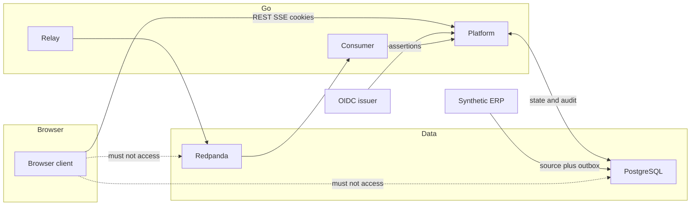

# Threat model

Threats against the implemented Event Spine and Identity HTTP surfaces. Not a
pentest or production assessment. Later surfaces (approvals, RAG, Python,
object storage, production IdP) are out of scope here.

Test-environment isolation evidence: [EVIDENCE.md](../../EVIDENCE.md)
`CLM-007`–`CLM-010`.

## Trust

| Party | Role |
| --- | --- |
| Go (`identity/`, `api/`, `platform/`, `relay/`, `erp/`) | Authoritative authorization and transactional state |
| PostgreSQL | Authoritative store (source, outbox, inbox, projection, audit). A DB login is not a policy bypass. |
| Redpanda | At-least-once transport. Events still need tenant, identity, and version checks. |
| External IdP | Partially trusted assertions. Go validates principal and session independently. |
| Browser | Untrusted. May render and submit; cannot authorize. |
| Synthetic ERP | Source of accepted orders and outbox bytes; not SeshatOps policy. |

Client-supplied identifiers, cookies forged by the client, and UI buttons are
untrusted until Go validates them.

## Threats that matter now

| ID | Threat | Control |
| --- | --- | --- |
| T-01 | Cross-tenant read or mutate via path, header, body, or colliding IDs | Path tenant is an assertion; allow-list is same-tenant; 403/404 fail closed |
| T-02 | UI hides a control, caller invokes the API anyway | Go default-deny; UI is not a boundary |
| T-03 | Forged, swapped, stale, or expired session / ID token | Session gate 401; assertion checks before `identity.Store` |
| T-04 | Client-supplied principal or tenant treated as authority | Ignored; session + platform assignment only |
| T-05 | Reader performs quarantine, replay, rebuild, or audit read | `MX-004`–`MX-007` are operator-only |
| T-06 | Operator inventory read without `MX-001` | Denied |
| T-07 | Privileged mutation with no audit row | Insert-before-mutate; insert failure blocks the mutation |
| T-08 | Duplicate or replayed events double inventory effects | Inbox dedup + aggregate version; see [CONTRACTS.md](../../CONTRACTS.md) |
| T-09 | Poison / unsupported version / version gap halt all consumers | Quarantine; unrelated aggregates continue |
| T-10 | Service principal used as a user role | No MX rows; deny on user HTTP paths |
| T-11 | Rebuild or replay applies another tenant's history | Same-tenant bytes and derived-state reset only |

Residual risk: library/test OIDC (not production revocation), process-local
sessions and assignments, operator=reviewer for the recorded campaign, no
pentest.

Authorization detail: [AUTHORIZATION.md](AUTHORIZATION.md).
Decision: [ADR-0005](../adrs/0005-identity-tenant-policy-and-service-delegation.md).
